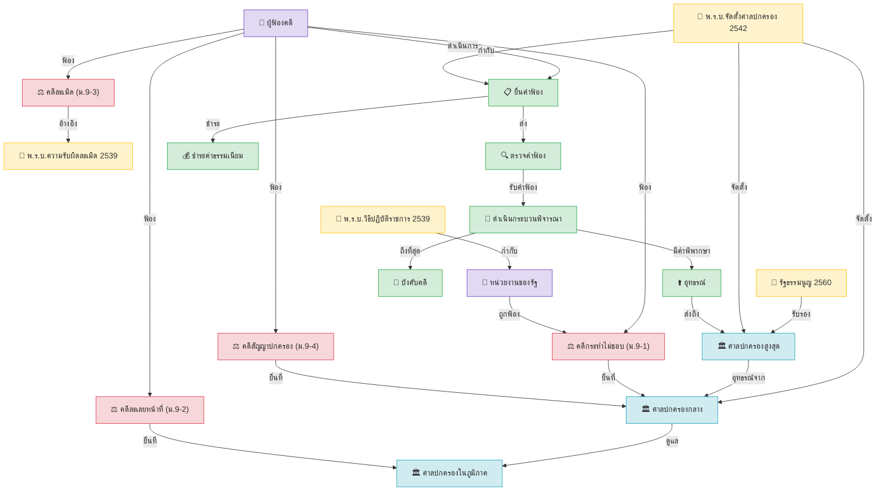
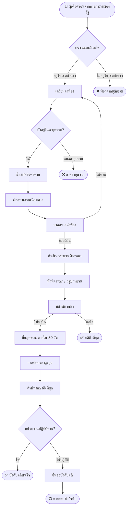

# Knowledge Graph: ระบบศาลปกครองไทย

## Entity Relationship Diagram



---

## เขตอำนาจศาลปกครอง

```mermaid
graph LR
    SUPREME["🏛️ ศาลปกครองสูงสุด"]
    subgraph ภาคกลาง
        CENTRAL["ศาลปกครองกลาง\n(กทม, นนทบุรี, ปทุมธานี, นครปฐม\nสมุทรปราการ, สมุทรสาคร, สระบุรี, นครนายก)"]
        RAYONG["ศาลปกครองระยอง\n(ระยอง, ชลบุรี, จันทบุรี, ตราด, ฉะเชิงเทรา)"]
    end
    subgraph ภาคเหนือ
        CM["ศาลปกครองเชียงใหม่\n(เชียงใหม่, เชียงราย, ลำปาง, ลำพูน\nแม่ฮ่องสอน, พะเยา, แพร่, น่าน)"]
        PHIT["ศาลปกครองพิษณุโลก\n(พิษณุโลก, สุโขทัย, อุตรดิตถ์, เพชรบูรณ์, ตาก)"]
    end
    subgraph ภาคตะวันออกเฉียงเหนือ
        KORAT["ศาลปกครองนครราชสีมา\n(นครราชสีมา, บุรีรัมย์, สุรินทร์, ชัยภูมิ)"]
        KK["ศาลปกครองขอนแก่น\n(ขอนแก่น, มหาสารคาม, กาฬสินธุ์)"]
        UBN["ศาลปกครองอุบลราชธานี\n(อุบลฯ, ร้อยเอ็ด, ศรีสะเกษ, ยโสธร, อำนาจเจริญ)"]
    end
    subgraph ภาคใต้
        SKL["ศาลปกครองสงขลา\n(สงขลา, พัทลุง, ตรัง, สตูล\nปัตตานี, ยะลา, นราธิวาส)"]
    end
    SUPREME --> CENTRAL
    SUPREME --> RAYONG
    SUPREME --> CM
    SUPREME --> PHIT
    SUPREME --> KORAT
    SUPREME --> KK
    SUPREME --> UBN
    SUPREME --> SKL
```

---

## กระบวนการฟ้องคดีปกครอง (Flowchart)



---

*สร้างโดย Pipeline เมื่อ: 2026-06-06 02:01*